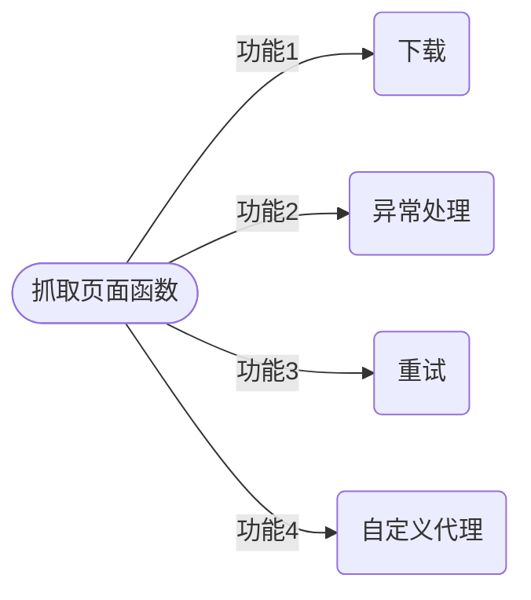
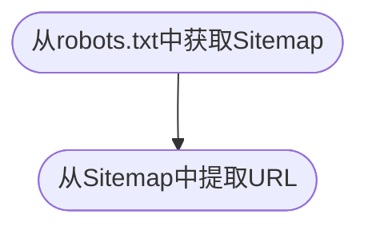

# 一、网站背景调研

爬取网站前需要先对目标站点的规模和结构进行调研。主要分为`robots.txt`和`Sitemap`文件。


* **robots.txt**

`robots.txt`文件描述了网站爬取的限制，可以将爬虫被封禁的可能性降至最低，也可以了解网站结构。


* **Sitemap**

`Sitemap`文件可以帮助爬虫定位网站最新内容，而无需爬取所有网页（[网站地图标准定义](https://sitemaps.org/protocol.html)）。“网站地图”提供了*<u>所有网页链接</u>*，但可能存在缺失、过期、不完整的问题。


* **估算网站大小**

网站大小会影响我们爬取方式的选择。一般爬取只有几百个URL的网站，效率没有那么重要；但如果某网站拥有数百万个URL，使用串行下载可能需要数月时间，这时就需要用到分布式下载方式。

估算网站大小可以通过检查`Google爬虫`的结果，因为Google可能已经怕去过我们感兴趣的网站，并做过相关工作了。


* **识别网站所用技术**

网站所用到的技术类型也会影响到我们爬取方式的选择。

检查网站构建技术类型的模块是`detectem`，该模块需要python3.5以上版本以及`Docker`。

安装（[官网安装](https://www.docker.com/)）完Docker后可以利用下列命令拉取最新Docker镜像：

```shell
docker pull scrapinghub/splash
pip install detectem
```

`detectem`模块基于`splash`，使用一系列请求和响应来探测网站所用技术。

`splash`是由`scrapinghub`开发的一个脚本化浏览器。

想要运行该模块只需使用`det`命令即可。例如：

```python
det www.baidu.com
```


* **网站所有者**

有的所有者可能会封禁爬虫，最好将下载速度控制得保守些。

可以利用`WHOIS`协议查询域名的注册者是谁。python中有一个对应该协议的封装库`python-whois`，使用前用pip安装即可（`pip install python-whois`）。

```python
import whois
print(whois.whois('www.baidu.com')) #这里用百度域名来测试
```

结果如下：


可以看到最后的`"org"`字段是：北京百度公司。


* **三种网站爬取方法**
    1. 爬取`sitemap`网站地图
    2. 使用`数据库ID遍历`每个网页
    3. 跟踪`网页链接`


* **抓取与爬取的区别**

    `抓取`通常针对特定网站，并在网站上获取指定信息。1）用于访问特定页面的指定信息；2）若站点发生变化或站点中位置信息发生变化则需要进行修改。

    `爬取`采用更通用方式来构建，其目标是一系列顶级域名网站或整个网络。爬取可以用来收集更多具体信息。（更多情况是爬取网络，从很多网站中或页面中获取小而通用的信息，然后跟踪链接到其他页面中）

    `网络爬虫`可以用来爬取指定的一系列网站，或是在多个站点甚至整个互联网中进行更广泛的爬取。


* **下载网页**

使用`urllib`模块的一些函数进行网页下载：

```python
import urllib.request
def download(url):
    return urllib.request.urlopen(url).read()
```


但是时常会有网页不存在等***异常***情况需要捕获并处理：

```python
import urllib.request
from urllib.error import URLError,HTTPError,ContentTooShortError
def download(url):
    print('Download:',url)
    try:
        html = urllib.request.urlopen(url).read()
    except (URLError,HTTPError,ContentTooShortError) as e:
        print('Download error:',e.reason)
        html = None;
    return html
# 出现URL下载错误时，该函数能捕获异常并返回None
```


有时会遇到暂时性错误（如：5xx错误类型），可以重新下载

```python
import urllib.request
from urllib.error import URLError,HTTPError,ContentTooShortError
def download(url,num_retries=2):  #添加重新下载参数
    print('Download:',url)
    try:
        html = urllib.request.urlopen(url).read()
    except (URLError,HTTPError,ContentTooShortError) as e:
        print('Download error:',e.reason)
        html = None;
        if num_retries > 0:  
            # 遇5xx错误码递归调用自身进行重试
            if hasattr(e,'code') and 500 <= e.code < 600:  
                return download(url,num_retries - 1)
    return html
```


* **设置用户代理**

下载网页的默认用户代理是：`python-urllib/3.x`（最后是python版本号）。

但使用**可辨识**的用户代理可以避免网络爬虫遇到一些问题，甚至一些网站会封禁这个默认用户代理。

因此我们可以自己设定用户代理，下例设置了一个名为`wswp`（Web Scraping with Python）：

```python
import urllib.request
from urllib.error import URLError,HTTPError,ContentTooShortError
def download(url,user_agent='wswp',num_retries=2):  #添加自定义用户代理wswp
    print('Download:',url)
    request = urllib.request.Request(url)
    request.add_header('User-agent',user_agent)
    try:
        html = urllib.request.urlopen(request).read()
    except (URLError,HTTPError,ContentTooShortError) as e:
        print('Download error:',e.reason)
        html = None;
        if num_retries > 0:  
            if hasattr(e,'code') and 500 <= e.code < 600:  
                return download(url,num_retries - 1)
    return html

#上述函数满足了三个需求：1）下载；2）捕获异常；3）重试下载；4）设置用户代理
#这个下载函数之后会经常用到，非常典型
```

下载网页函数功能拆解：




* **网站地图爬虫**



```python
import re
import urllib
import urllib.request
from urllib.error import URLError,HTTPError,ContentTooShortError
url = 'http://example.python-scraping.com/sitemap.xml'
def download(url,user_agent='wswp',num_retries=2,charset='utf-8'):#添UTF-8参数
    print('Download:',url)
    request = urllib.request.Request(url)
    request.add_header('User-agent',user_agent)
    try:
        response = urllib.request.urlopen(request)
        cs = response.headers.get_content_charset()
        if not cs:
            cs = charset
        #想要用正则表达式处理响应，响应需要是字符串，故更新字符编码为UTF-8将字节变为字符串
        html = response.read().decode(cs)  #read方法返回的响应是字节形式
    except (URLError,HTTPError,ContentTooShortError) as e:
        print('Download error:',e.reason)
        html = None;
        if num_retries > 0:  
            if hasattr(e,'code') and 500 <= e.code < 600:  
                return download(url,num_retries - 1)
    return html

def craw_sitemap(url):
    sitemap = download(url)
    links = re.findall('<loc>(.*?)</loc>',sitemap)
    for link in links:
        html = download(link)
```


* **数据库ID遍历**

在[示例网站](http://example.python-scraping.com/places/default/index/0)中，我们发现不同国家的网页URL只有最后一部分有区别：

```html
http://example.python-scraping.com/places/default/view/Afghanistan-1
http://example.python-scraping.com/places/default/view/Brazil-32
```

URL中包含**页面别名**是非常普遍的做法，这里的页面别名就是国家或地区名加上ID，可以对**搜索引擎优化**（Search Engine Optimization，**SEO**）起到帮助作用。

一般Web服务器会忽略别名的字符串，**只使用ID来匹配**数据库中的相关记录，例如：将上例中Brazil去掉只留下32链接依旧可以生效。

```python
import itertools

def crawl_site(url):
    for page in itertools.count(1):
        pg_url = '{}{}'.format(url,page)
        html = download(pg-url)
        if html is None:
            break

url = 'http://example.python-scraping.com/places/default/view/-'            
crawl_site(url)  

# 在这段代码中，我们对ID进行遍历，直到出现下载错误为止
```

这种实现方式存在一个缺陷是：某些记录可能已被删除，ID之间不是连续的，只要访问到某个间隔点（发现缺失ID）爬虫就会退出。需要针对这种情况进行改进：

```python
def crawl_site(url,max_errors=5):  #设定最大错误次数5
    for page in itertools.count(1):
        pg_url = '{}{}'.format(url,page)
        html = download(pg-url)
        if html is None:
            num_errors += 1
            if num_errors == max_errors: #如果连续发生5次错误才会退出爬虫程序
                break
            else:
                num_errors = 0
```


* **链接爬虫**

有时候我们需要让爬虫表现得更像普通用户，跟踪链接，访问感兴趣的内容。